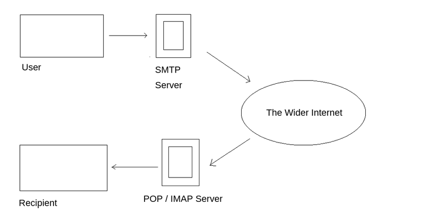

# NFS (Network File System)

NFS stands for "Network File System" and allows a system to share directories and files with others over a network. By using NFS, users and programs can access files on remote systems almost as if they were local files. It does this by mounting all, or a portion of a file system on a server. The portion of the file system that is mounted can be accessed by clients with whatever privileges are assigned to each file.

## Working 

First, the client will request to mount a directory from a remote host on a local directory just the same way it can mount a physical device. The mount service will then act to connect to the relevant mount daemon using RPC.

The server checks if the user has permission to mount whatever directory has been requested. It will then return a file handle which uniquely identifies each file and directory that is on the server.

If someone wants to access a file using NFS, an RPC call is placed to NFSD (the NFS daemon) on the server. This call takes parameters such as:

-  The file handle
-  The name of the file to be accessed
-  The user's, user ID
-  The user's group ID

## NFS-common

It is important to have this package installed on any machine that uses NFS, either as client or server. It includes programs such as: **ockd, statd**, **showmount**, **nfsstat,** **gssd**, **idmapd** and **mount.nfs**. Primarily, we are concerned with "showmount" and "mount.nfs" as these are going to be most useful to us when it comes to extracting information from the NFS share. If you'd like more information about this package, feel free to read: [https://packages.ubuntu.com/jammy/nfs-common (opens in new tab)](https://packages.ubuntu.com/jammy/nfs-common).

## NFS Exploitation 

### What is root_squash?

By default, on NFS shares- Root Squashing is enabled, and prevents anyone connecting to the NFS share from having root access to the NFS volume. Remote root users are assigned a user **“nfsnobody”** when connected, which has the least local privileges. Not what we want. However, if this is turned off, it can allow the creation of SUID bit files, allowing a remote user root access to the connected system. 

# SMTP (Simple Mail Transfer Protocol)

It is utilised to handle the sending of emails. In order to support email services , a protocol pair is required, comprising of SMTP and POP/IMAP. Together they allow the user to send outgoing mail and retrieve incoming mail.

The three basic functions of SMTP are 
- It verifies who is sending the emails through the smtp server 
- It sends the outgoing mail
- If the outgoing mail can't be delivered it sends the message back to the sender.

## POP ans IMAP

POP ( Post Office Protocol ) and IMAP ( Internet Message Access Protocol ) these are responsible for the transfer of email between client and the mail server.
The main difference is in POP's more simplistic approach of downloading the inbox from the mail server, to the client.
Where IMAP will synchronise the current inbox, with the new mail on the server, downloading any thing new.

## How does SMTP works 

### Steps 

1. The mail user agent, which is either your email client or an external program. connects to the SMTP server of your domain ex- smtp.google.com. This initiates the SMTP handshake. This connection works over the smtp port **25** (usually) , now the SMTP session starts.
2. The client then submits the sender, and the recipient's email address and the body of the email with any attachments to the server.
3. The SMTP server then checks if the domain name of the recipient and the sender is the same.
4. The SMTP sever of the sender will make a connection to the recipient's SMTP server before relaying the email. If the recipient's server cant be accessed then the mail is put into the queue.
5. Then the recipient's SMTP server will verify the the incoming email. The server then forewards the email to POP or IMAP server.
6. The email will show up in the recipient's inbox.

# MySQL (Structured Query Language)

MySQL, as an RDBMS, is made up of the server and utility programs that help in the administration of MySQL databases.

The server handles all database instructions like creating, editing, and accessing data. It takes and manages these requests and communicates using the MySQL protocol. This whole process can be broken down into these stages:  

1. MySQL creates a database for storing and manipulating data, defining the relationship of each table.
2. Clients make requests by making specific statements in SQL.
3. The server will respond to the client with whatever information has been requested.