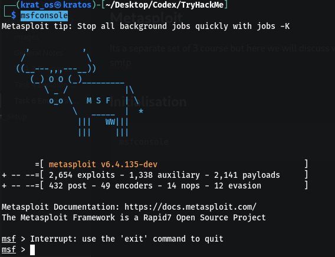
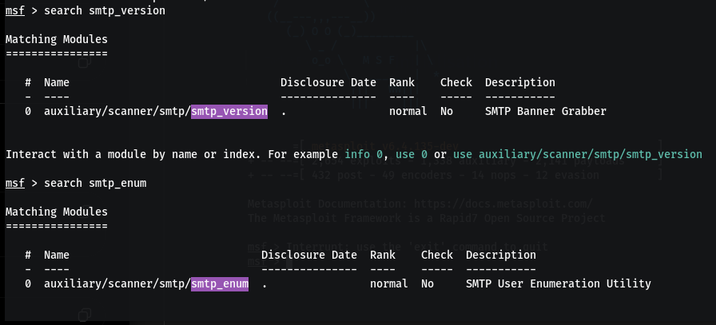
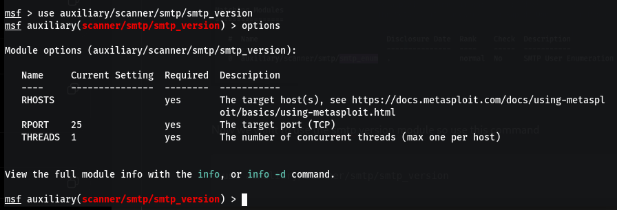
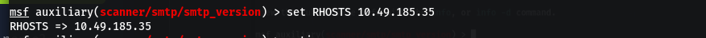
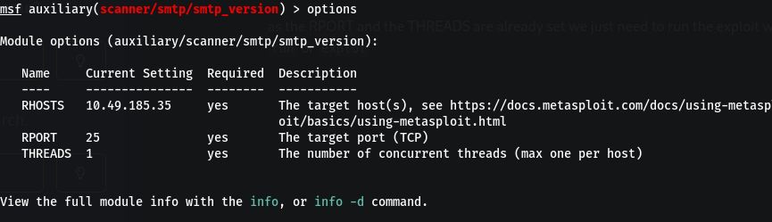
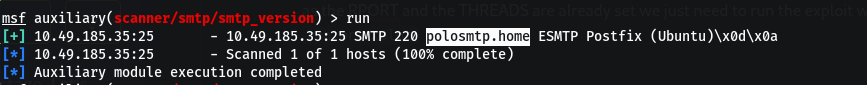
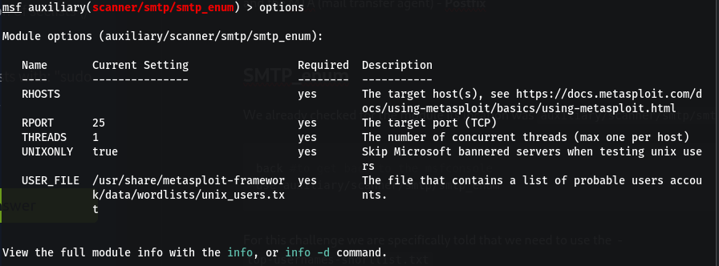
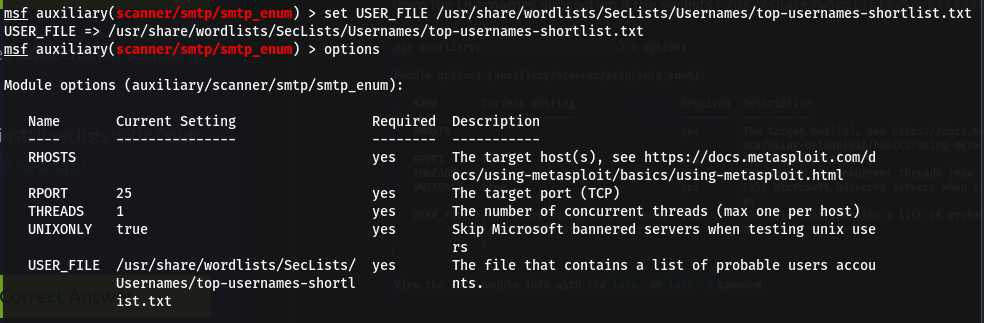
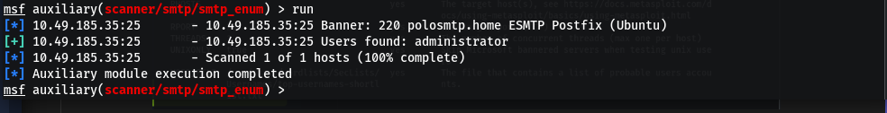

The SMTP service has 2 internal commands that allow enumeration
1. VRFY - confirming the names of valid users 
2. EXPN - which reveals the actual addresses of user's aliases and the list of e-mail(mailing list)
we use **metasploit** to do this 

# Metasploit

Its a separate set of 3 course but here we will discuss what is used in enumerating the smtp

## Initialisation

```bash
msfconsole
```




here first we have to find some modules if they are present or not we do by just writing
`search <module_name>`



## SMTP_version

Now we want to use the smtp version module so use this command 

```bash 
use auxiliary/scanner/smtp/smtp_version
```

Then you will be prompted with the module and you can use that , you can see the different functions by typing  `options` ( we have to set the required fields to make it work )



use this to set the Host for RHOSTS ( ie the machine being attacked )

```bash
set RHOSTS 10.49.185.35
```




as the RPORT and the THREADS are already set we just need to run the exploit we type either 
`run` or `explot` 



Here we get the mail name for the system as - **polosmtp.home**
and the MTA (mail transfer agent) - **Postfix**


## SMTP_enum

We already checked for the module its location was `auxiliary/scanner/smtp/smtp_enum`

```bash
back #to get back to the msfconsole
use auxiliary/scanner/smtp/smtp_enum
```

For this challenge we are specifically told that we need to use the  - 
`top-usernames-shortlist.txt`
from the Usernames subsection if the seclists (`/usr/share/wordlists/SecLists/Usernames`)



So basically we have to set the `USER_FILE` to the said wordlist

But before that ensure to download it 

```bash
sudo apt update
sudo apt install seclists
```


```bash
set USER_FILE /usr/share/wordlists/secLists/Usernames/top-usernames-shortlist.txt
```



similarly set the RHOSTS 

```bash
msf auxiliary(scanner/smtp/smtp_enum) > set RHOSTS 10.49.185.35
RHOSTS => 10.49.185.35
```

Now use the `run` 



Now to the Exploiting part 
