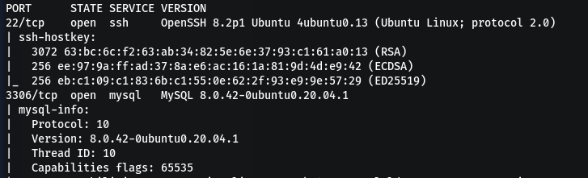
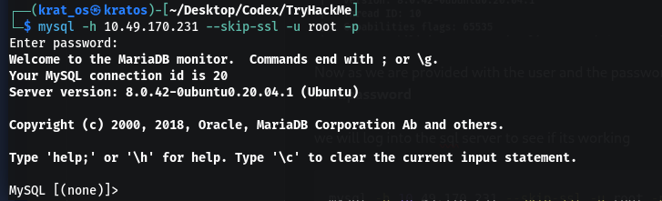
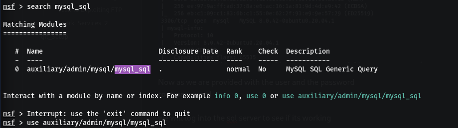
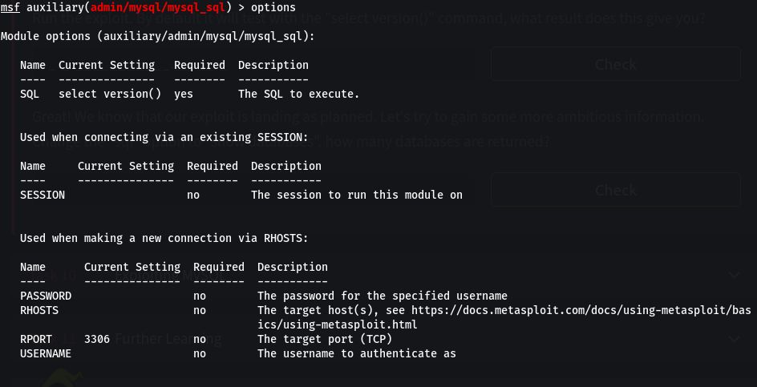
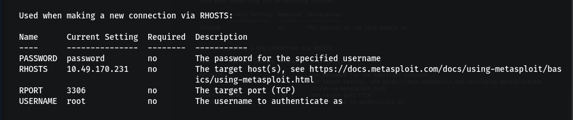
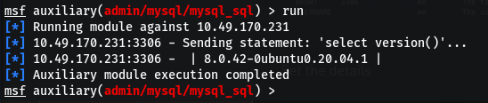
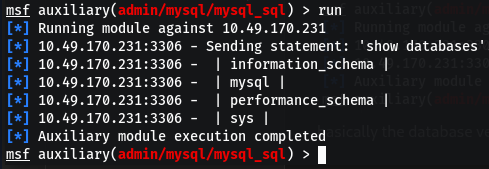

# Port Scanning 

```bash
mysql -h 10.49.170.231 --ssl-mode=DISABLED -u root -p
```



Now as we are provided with the user and the password 
**root:password**

we will log into the sql server to see if its working 

```bash 
mysql -h 10.49.170.231 --skip-ssl -u root -p
```

or 

```bash
mysql -h 10.49.170.231 --ssl-mode=DISABLED -u root -p
```

the skip ssl or disabled is for the TSL/SSL error that you will be prompted with 


# Metasploit




Set the details



The by default select version() will give you some details about the mysql system 
basically the database version is `8.0.42-0ubuntu0.20.04.1

we can change the command to see what it returns  (we used `show databases`)


